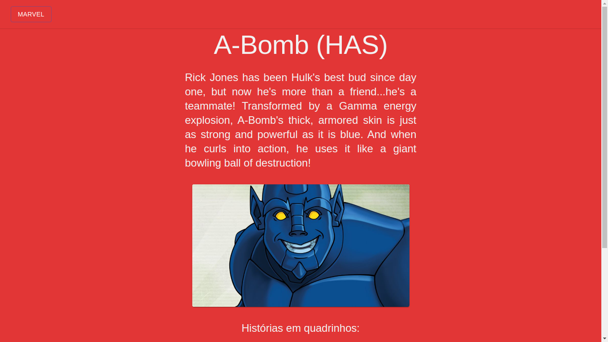

<h1 align="center"> <strong>🔥 Challenge Marvel</strong></h1>

<p align="center">


</p>

<br />
<p align="center"></p>
<p align="center"></p>

<br />

# 🛠️Technologies

This project was made using the follow technologies:

- [TypeScript](https://www.typescriptlang.org/)
- [React](https://reactjs.org)
- [NextJS](https://nextjs.org/)
- [Axios](https://github.com/axios/axios)
- [MaterialUI](https://material-ui.com/)

# 🏃Getting Started

```sh
#  Clone Repository
$ git clone  https://github.com/wesleywcr/ChallengeMarvel.git
```

```sh
# Install Dependencies
$ yarn install
# Start application
$ yarn dev
```
